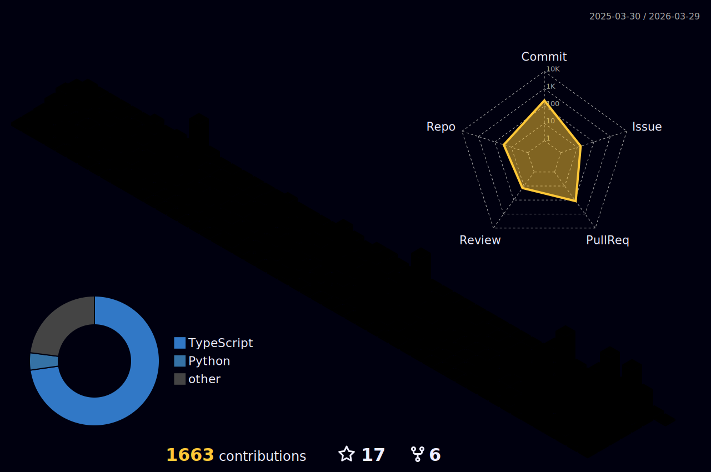

# Hi, I'm Francisco Miguel Perez 👋

## Full Stack Developer | Systems Engineering Student | Tech Enthusiast

I'm a full-stack developer who thrives on challenges and delivers robust, scalable web solutions. 
Fearless in exploring new technologies, I write clean, efficient code and consistently push boundaries.

## About Me

- 👨‍💻 Full Stack Developer with expertise in Python, .NET, React, and more.
- 🎓 Systems Engineering Student at Universidad Tecnológica Nacional.
- 💼 Experience at Rolling Code Studio
- 🏆 [NASA Space Apps Hackathon 2024 Winning Project.](https://www.spaceappschallenge.org/nasa-space-apps-2024/find-a-team/la-banda-de-marshall/)
- 💡 Passionate about optimization and continuous improvement.

## Tech Stack

- **Languages**: Python, JavaScript, C#, Java, TypeScript
- **Frameworks**: React, Next.js, Node.js, Nest.js
- **Databases**: PostgreSQL, MySQL, MongoDB, Supabase,  PrismaORM, TypeORM, Sequelize.
- **Tools**: Git, GitHub, Docker, Jest, Playwright, CI/CD.
- **UI Libraries**: TailwindCSS, ShadCN, Ant Design, Bootstrap
- **CLOUD**: Aws

## Connect with Me

- [LinkedIn](https://www.linkedin.com/in/franprzdev)
- [Email](franciscoperezdeveloper@gmail.com)
- [Portfolio](notavaliable.com)

    

Thanks for visiting my profile! Feel free to reach out if you have any questions or collaboration opportunities.
