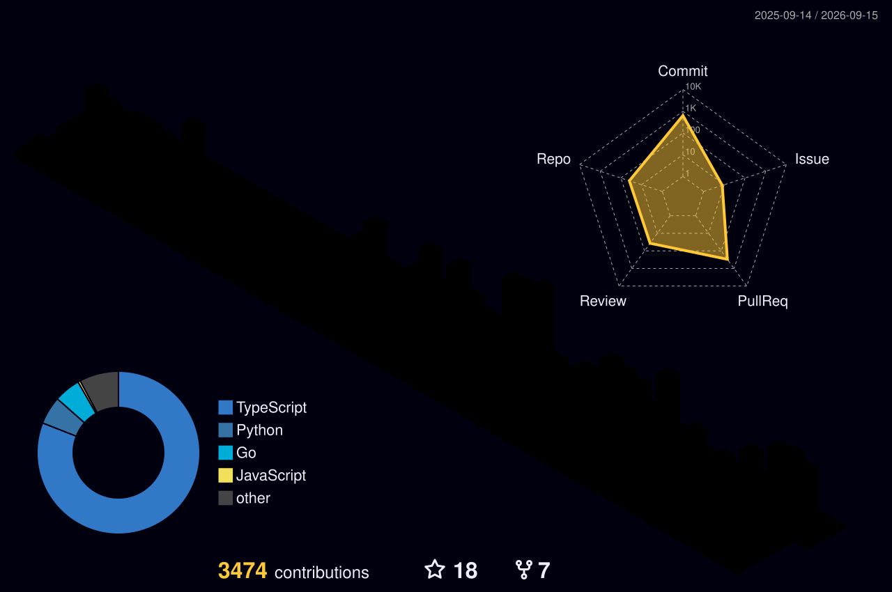

# Hi, I'm Francisco Perez

**AI Engineer · Information Systems Engineer (UTN-FRT) · Tucumán, Argentina**

I went from full-stack to applied AI: multi-agent systems, RAG pipelines and workflow automation that actually ship to production. Product sense, strategic thinking, and a habit of turning hackathons into working software.

- 🤖 AI Engineer @ **RepuestoShop** — multi-agent systems + custom RAG with LangChain/LangGraph, Meta APIs tooling, scraping pipelines for data grounding
- 🧑‍🏫 Instructor — 20h **n8n automation course** for the Tucumán Judiciary (own materials, live builds, RAG + Human-in-the-Loop)
- 🏆 **NASA Space Apps 2024 National Winner** (ExoGames) · 2025 national competitor · Vortex n8n hackathon on-site
- 🌱 Final-year Systems Engineering student @ UTN-FRT · ex Product Engineer @ RollingCode Studio

## Stack

              

`LangChain · LangGraph · n8n · RAG pipelines · agent harness · tool calling · Playwright scraping · Tailwind · Railway`

## Featured

| Project | What |
| --- | --- |
| [Scrapping-Repuestos-UY-API](https://github.com/FranprzDev/Scrapping-Repuestos-UY-API) | NestJS scraping API for spare-parts catalogs (UY): HTTP + JSON-LD first, Playwright fallback, quality gate |
| [n8n-nodes-timed-buffer](https://github.com/FranprzDev/n8n-nodes-timed-buffer) | Community n8n node: Redis-backed time-windowed message buffer |
| [apuntes-cli](https://github.com/FranprzDev/apuntes-cli) | CLI that generates compact FAQs + final-exam notes per subject |
| [gpozos-game](https://github.com/FranprzDev/gpozos-game) | Educational 2D game: water-network investments vs a Linear Programming optimum |
| [BeeAgro-Spanish](https://github.com/FranprzDev/BeeAgro-Spanish) · [ExoGames](https://github.com/FranprzDev/NASASpaceApp-Marshall-Arg) | NASA Space Apps 2025 & 2024 (national winner) |

## Stats

    

## Connect

