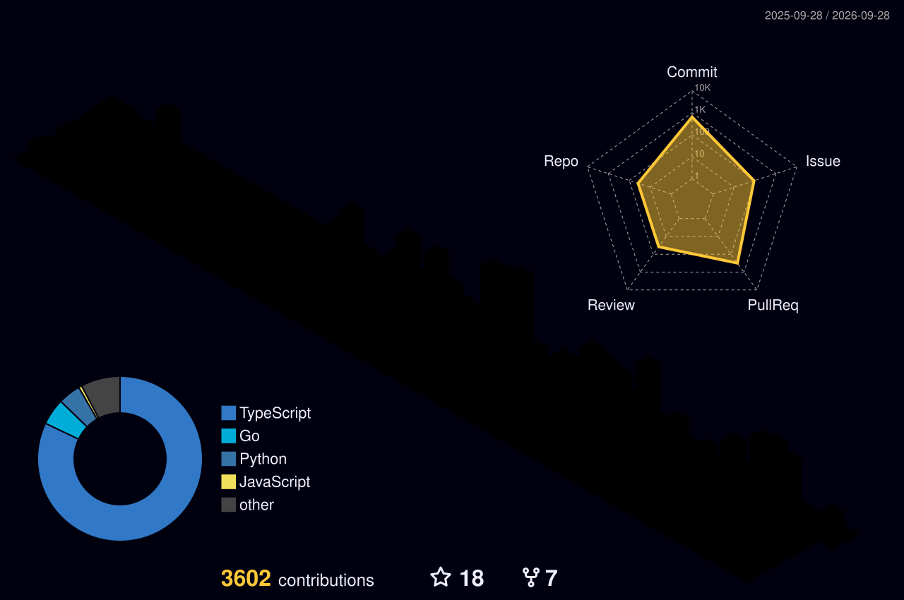

# Francisco Perez

**I build AI systems that actually ship** — multi-agent apps, RAG pipelines, and automations that end up used by real teams.

AI Engineer in Tucumán, Argentina · final-year Systems Engineering @ UTN-FRT. I turn messy real-world problems into working software, usually with an LLM in the loop.

🏆 **NASA Space Apps 2024 — National Winner** ([ExoGames](https://github.com/FranprzDev/NASASpaceApp-Marshall-Arg)) · national competitor 2025 ([BeeAgro](https://github.com/FranprzDev/BeeAgro-Spanish))

---

## What I'm doing now

- **AI Engineer @ RepuestoShop** — multi-agent systems + custom RAG with LangChain/LangGraph, Meta APIs tooling, and scraping pipelines for data grounding.
- **Instructor** — designing and teaching a 20h **n8n automation course** for the Tucumán Judiciary (own materials, live builds, RAG + human-in-the-loop).

## Selected work

**[n8n-nodes-timed-buffer](https://github.com/FranprzDev/n8n-nodes-timed-buffer)** — a published community n8n node: a Redis-backed, time-windowed message buffer. Built because n8n had no clean way to batch bursts of events.

**[Scrapping-Repuestos-UY-API](https://github.com/FranprzDev/Scrapping-Repuestos-UY-API)** — NestJS API that turns messy spare-parts catalogs into clean data: HTTP + JSON-LD first, Playwright fallback, quality gate.

**[apuntes-cli](https://github.com/FranprzDev/apuntes-cli)** — CLI that turns raw class material into compact FAQs and final-exam notes, per subject.

*Also around:* [gpozos-game](https://github.com/FranprzDev/gpozos-game) (water-network investments vs a Linear Programming optimum).

## Background

- Ex Product Engineer @ RollingCode Studio
- Vortex n8n hackathon (on-site) · NASA Space Apps 2024 & 2025

## Stack

Python · TypeScript · Go · Next.js · React · NestJS · Node · Postgres · Redis · MongoDB · Docker · AWS · Linux

`LangChain · LangGraph · n8n · RAG · agent harness · tool calling · Playwright`

## Stats

    

## Connect

